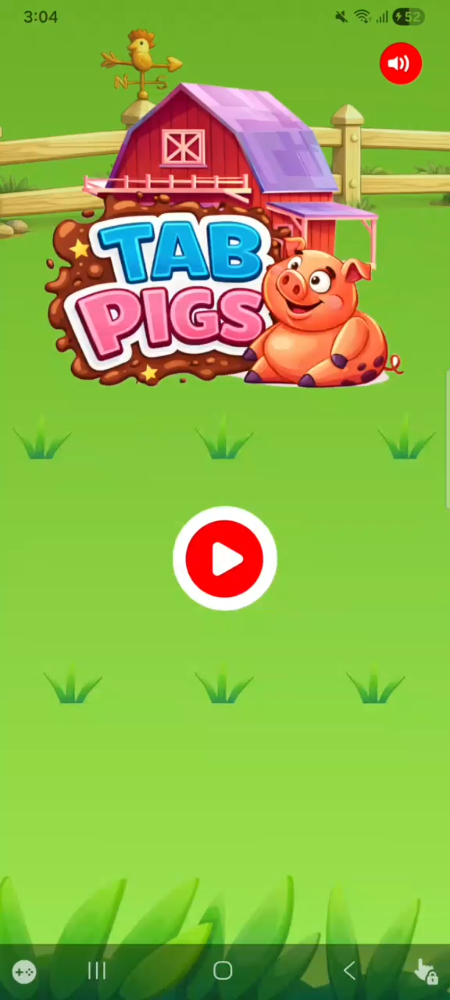
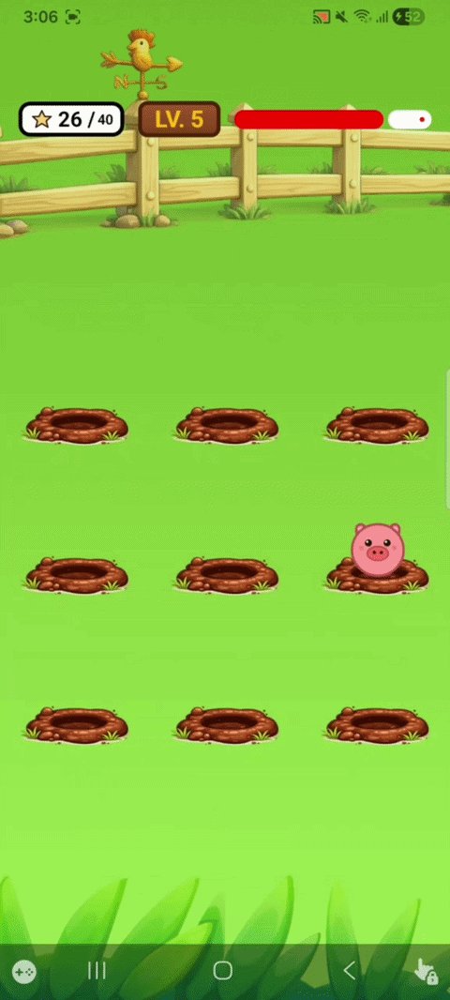

# 🐷 Tab Pigs

Tab Pigs is an addictive farm-themed casual Android game. Inspired by the classic "Whack-a-Mole" mechanics, this game challenges players to tap on popping pigs as fast as possible, collect rare golden pigs, and avoid time bomb traps!

## 📸 Preview

  
  &nbsp; &nbsp; &nbsp;
  

## ✨ Key Features
* **Dynamic Item Spawning:**
    * Normal Pig = +1 Point
    * Golden Pig = +1 Point and reduces target score
    * Random Bomb = -1 Point
* **Interactive Audio:** Features upbeat country background music and interactive sound effects.

## 🛠️ Tech Stack & Architecture
This game is built using modern native Android technologies:
* **Language:** Kotlin
* **UI Framework:** Jetpack Compose
* **Asynchronous:** Kotlin Coroutines
* **Audio:** MediaPlayer API

## 🎵 Music Credit
* **Background Music:** [Bright Sun - Optimistic Country Music Loop](https://pixabay.com/music/upbeat-bright-sun-optimistic-country-music-loop-459690/) by **sonican** (via Pixabay).

## 📌 ToDo Features
- [ ] Add save/load memory system.
- [ ] High Score Tracker.
- [ ] And many more...